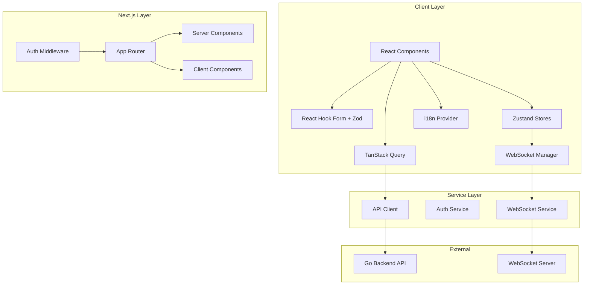

# Design Document

## Overview

PayNaiDee Frontend is a production-ready Next.js 14+ application using the App Router architecture. The application provides a mobile-first expense sharing experience with real-time chat, bill splitting, and PromptPay QR code payments. The architecture emphasizes type safety, maintainability, and optimal performance through strategic use of Server and Client Components.

## Architecture

### High-Level Architecture



### Directory Structure

```
src/
├── app/                          # Next.js App Router
│   ├── (auth)/                   # Auth route group (public)
│   │   ├── login/
│   │   │   └── page.tsx
│   │   └── layout.tsx
│   ├── (protected)/              # Protected route group
│   │   ├── dashboard/
│   │   │   └── page.tsx
│   │   ├── groups/
│   │   │   ├── [id]/
│   │   │   │   ├── page.tsx
│   │   │   │   ├── chat/
│   │   │   │   │   └── page.tsx
│   │   │   │   └── bills/
│   │   │   │       ├── page.tsx
│   │   │   │       ├── new/
│   │   │   │       │   └── page.tsx
│   │   │   │       └── [billId]/
│   │   │   │           └── page.tsx
│   │   │   └── settings/
│   │   │       └── page.tsx
│   │   ├── friends/
│   │   │   └── page.tsx
│   │   ├── profile/
│   │   │   └── page.tsx
│   │   └── layout.tsx
│   ├── layout.tsx                # Root layout
│   ├── page.tsx                  # Landing/redirect
│   └── globals.css
├── components/
│   ├── ui/                       # Base UI components
│   │   ├── button.tsx
│   │   ├── input.tsx
│   │   ├── card.tsx
│   │   ├── modal.tsx
│   │   ├── avatar.tsx
│   │   ├── badge.tsx
│   │   ├── skeleton.tsx
│   │   ├── toast.tsx
│   │   └── spinner.tsx
│   ├── forms/                    # Form components
│   │   ├── login-form.tsx
│   │   ├── bill-form.tsx
│   │   ├── group-form.tsx
│   │   └── profile-form.tsx
│   ├── chat/                     # Chat components
│   │   ├── chat-container.tsx
│   │   ├── message-list.tsx
│   │   ├── message-item.tsx
│   │   ├── message-input.tsx
│   │   └── typing-indicator.tsx
│   ├── bills/                    # Bill components
│   │   ├── bill-card.tsx
│   │   ├── bill-detail.tsx
│   │   ├── participant-list.tsx
│   │   ├── split-calculator.tsx
│   │   └── qr-code-display.tsx
│   ├── groups/                   # Group components
│   │   ├── group-card.tsx
│   │   ├── group-detail.tsx
│   │   ├── member-list.tsx
│   │   └── member-role-badge.tsx
│   ├── friends/                  # Friend components
│   │   ├── friend-card.tsx
│   │   ├── friend-search.tsx
│   │   └── friend-request-card.tsx
│   ├── layout/                   # Layout components
│   │   ├── header.tsx
│   │   ├── bottom-nav.tsx
│   │   ├── sidebar.tsx
│   │   └── page-container.tsx
│   └── providers/                # Context providers
│       ├── query-provider.tsx
│       ├── auth-provider.tsx
│       ├── websocket-provider.tsx
│       └── i18n-provider.tsx
├── lib/
│   ├── api/                      # API client
│   │   ├── client.ts             # Axios/fetch wrapper
│   │   ├── auth.ts               # Auth endpoints
│   │   ├── users.ts              # User endpoints
│   │   ├── groups.ts             # Group endpoints
│   │   ├── bills.ts              # Bill endpoints
│   │   ├── messages.ts           # Message endpoints
│   │   └── types.ts              # API response types
│   ├── websocket/                # WebSocket management
│   │   ├── client.ts             # WebSocket client class
│   │   ├── types.ts              # Message types
│   │   └── hooks.ts              # WebSocket hooks
│   ├── hooks/                    # Custom hooks
│   │   ├── use-auth.ts
│   │   ├── use-groups.ts
│   │   ├── use-bills.ts
│   │   ├── use-friends.ts
│   │   ├── use-chat.ts
│   │   └── use-media-query.ts
│   ├── stores/                   # Zustand stores
│   │   ├── auth-store.ts
│   │   ├── chat-store.ts
│   │   ├── ui-store.ts
│   │   └── index.ts
│   ├── utils/                    # Utilities
│   │   ├── currency.ts           # Thai Baht formatting
│   │   ├── date.ts               # Day.js with timezone
│   │   ├── validation.ts         # Zod schemas
│   │   └── cn.ts                 # Tailwind class merge
│   └── i18n/                     # Internationalization
│       ├── config.ts
│       ├── locales/
│       │   ├── en.json
│       │   └── th.json
│       └── use-translation.ts
├── middleware.ts                 # Next.js middleware
└── types/                        # Global types
    ├── api.ts
    ├── models.ts
    └── websocket.ts
```

## Components and Interfaces

### API Client

```typescript
// lib/api/client.ts
import { getAccessToken, refreshTokens, clearTokens } from '@/lib/stores/auth-store';

const API_BASE_URL = process.env.NEXT_PUBLIC_API_URL || 'http://localhost:8080/api/v1';

interface APIResponse<T> {
  success: boolean;
  code: string;
  message: string;
  data: T;
}

interface PaginatedResponse<T> {
  items: T[];
  limit: number;
  offset: number;
  page: number;
}

class APIClient {
  private baseURL: string;

  constructor(baseURL: string) {
    this.baseURL = baseURL;
  }

  private async request<T>(
    endpoint: string,
    options: RequestInit = {}
  ): Promise<APIResponse<T>> {
    const token = getAccessToken();
    
    const headers: HeadersInit = {
      'Content-Type': 'application/json',
      ...(token && { Authorization: `Bearer ${token}` }),
      ...options.headers,
    };

    const response = await fetch(`${this.baseURL}${endpoint}`, {
      ...options,
      headers,
    });

    if (response.status === 401) {
      const refreshed = await refreshTokens();
      if (refreshed) {
        return this.request(endpoint, options);
      }
      clearTokens();
      window.location.href = '/login';
      throw new Error('Session expired');
    }

    const data = await response.json();
    
    if (!response.ok) {
      throw new APIError(data.code, data.message, response.status);
    }

    return data;
  }

  get<T>(endpoint: string) {
    return this.request<T>(endpoint, { method: 'GET' });
  }

  post<T>(endpoint: string, body?: unknown) {
    return this.request<T>(endpoint, {
      method: 'POST',
      body: body ? JSON.stringify(body) : undefined,
    });
  }

  put<T>(endpoint: string, body?: unknown) {
    return this.request<T>(endpoint, {
      method: 'PUT',
      body: body ? JSON.stringify(body) : undefined,
    });
  }

  delete<T>(endpoint: string) {
    return this.request<T>(endpoint, { method: 'DELETE' });
  }
}

export const apiClient = new APIClient(API_BASE_URL);
```

### WebSocket Client

```typescript
// lib/websocket/client.ts
type MessageHandler = (payload: unknown) => void;

interface WSMessage {
  type: string;
  payload: unknown;
}

export class PayNaiDeeWebSocket {
  private ws: WebSocket | null = null;
  private token: string;
  private handlers: Map<string, MessageHandler[]> = new Map();
  private reconnectAttempts = 0;
  private maxReconnectAttempts = 5;
  private reconnectTimeout: NodeJS.Timeout | null = null;

  constructor(token: string) {
    this.token = token;
  }

  connect(): Promise<void> {
    return new Promise((resolve, reject) => {
      const wsUrl = `${process.env.NEXT_PUBLIC_WS_URL}/ws?token=${this.token}`;
      this.ws = new WebSocket(wsUrl);

      this.ws.onopen = () => {
        this.reconnectAttempts = 0;
        resolve();
      };

      this.ws.onmessage = (event) => {
        const message: WSMessage = JSON.parse(event.data);
        const handlers = this.handlers.get(message.type) || [];
        handlers.forEach(handler => handler(message.payload));
      };

      this.ws.onerror = (error) => reject(error);

      this.ws.onclose = () => {
        this.attemptReconnect();
      };
    });
  }

  private attemptReconnect() {
    if (this.reconnectAttempts < this.maxReconnectAttempts) {
      const delay = Math.pow(2, this.reconnectAttempts) * 1000;
      this.reconnectTimeout = setTimeout(() => {
        this.reconnectAttempts++;
        this.connect();
      }, delay);
    }
  }

  on(type: string, handler: MessageHandler) {
    const handlers = this.handlers.get(type) || [];
    handlers.push(handler);
    this.handlers.set(type, handlers);
    return () => this.off(type, handler);
  }

  off(type: string, handler: MessageHandler) {
    const handlers = this.handlers.get(type) || [];
    this.handlers.set(type, handlers.filter(h => h !== handler));
  }

  send(type: string, payload: unknown) {
    if (this.ws?.readyState === WebSocket.OPEN) {
      this.ws.send(JSON.stringify({ type, payload }));
    }
  }

  sendMessage(groupId: number, content: string, metadata = '') {
    this.send('chat_message', { group_id: groupId, content, metadata });
  }

  sendTyping(groupId: number, isTyping: boolean) {
    this.send('typing', { group_id: groupId, is_typing: isTyping });
  }

  joinGroup(groupId: number) {
    this.send('join_group', { group_id: groupId });
  }

  leaveGroup(groupId: number) {
    this.send('leave_group', { group_id: groupId });
  }

  disconnect() {
    if (this.reconnectTimeout) {
      clearTimeout(this.reconnectTimeout);
    }
    this.ws?.close(1000, 'Client disconnect');
  }
}
```

### Zustand Stores

```typescript
// lib/stores/auth-store.ts
import { create } from 'zustand';
import { persist } from 'zustand/middleware';

interface User {
  id: number;
  username: string;
  email: string;
  display_name: string;
  avatar: string;
  role: 'user' | 'admin';
}

interface AuthState {
  user: User | null;
  accessToken: string | null;
  refreshToken: string | null;
  isAuthenticated: boolean;
  setAuth: (user: User, accessToken: string, refreshToken: string) => void;
  clearAuth: () => void;
  updateUser: (user: Partial<User>) => void;
}

export const useAuthStore = create<AuthState>()(
  persist(
    (set, get) => ({
      user: null,
      accessToken: null,
      refreshToken: null,
      isAuthenticated: false,
      setAuth: (user, accessToken, refreshToken) =>
        set({ user, accessToken, refreshToken, isAuthenticated: true }),
      clearAuth: () =>
        set({ user: null, accessToken: null, refreshToken: null, isAuthenticated: false }),
      updateUser: (userData) =>
        set((state) => ({
          user: state.user ? { ...state.user, ...userData } : null,
        })),
    }),
    { name: 'auth-storage' }
  )
);

// Helper functions for API client
export const getAccessToken = () => useAuthStore.getState().accessToken;
export const clearTokens = () => useAuthStore.getState().clearAuth();
```

```typescript
// lib/stores/chat-store.ts
import { create } from 'zustand';

interface Message {
  id: number;
  group_id: number;
  sender_id: number;
  content: string;
  type: 'text' | 'bill' | 'system';
  metadata: string;
  created_at: string;
}

interface TypingUser {
  userId: number;
  groupId: number;
}

interface ChatState {
  messages: Map<number, Message[]>; // groupId -> messages
  typingUsers: TypingUser[];
  addMessage: (groupId: number, message: Message) => void;
  setMessages: (groupId: number, messages: Message[]) => void;
  prependMessages: (groupId: number, messages: Message[]) => void;
  setTyping: (groupId: number, userId: number, isTyping: boolean) => void;
  clearChat: (groupId: number) => void;
}

export const useChatStore = create<ChatState>((set) => ({
  messages: new Map(),
  typingUsers: [],
  addMessage: (groupId, message) =>
    set((state) => {
      const newMessages = new Map(state.messages);
      const groupMessages = newMessages.get(groupId) || [];
      newMessages.set(groupId, [...groupMessages, message]);
      return { messages: newMessages };
    }),
  setMessages: (groupId, messages) =>
    set((state) => {
      const newMessages = new Map(state.messages);
      newMessages.set(groupId, messages);
      return { messages: newMessages };
    }),
  prependMessages: (groupId, messages) =>
    set((state) => {
      const newMessages = new Map(state.messages);
      const existing = newMessages.get(groupId) || [];
      newMessages.set(groupId, [...messages, ...existing]);
      return { messages: newMessages };
    }),
  setTyping: (groupId, userId, isTyping) =>
    set((state) => {
      if (isTyping) {
        return {
          typingUsers: [...state.typingUsers, { groupId, userId }],
        };
      }
      return {
        typingUsers: state.typingUsers.filter(
          (t) => !(t.groupId === groupId && t.userId === userId)
        ),
      };
    }),
  clearChat: (groupId) =>
    set((state) => {
      const newMessages = new Map(state.messages);
      newMessages.delete(groupId);
      return { messages: newMessages };
    }),
}));
```

### TanStack Query Hooks

```typescript
// lib/hooks/use-groups.ts
import { useQuery, useMutation, useQueryClient } from '@tanstack/react-query';
import { apiClient } from '@/lib/api/client';
import type { Group, CreateGroupRequest } from '@/types/models';

export const groupKeys = {
  all: ['groups'] as const,
  lists: () => [...groupKeys.all, 'list'] as const,
  detail: (id: number) => [...groupKeys.all, 'detail', id] as const,
  members: (id: number) => [...groupKeys.all, 'members', id] as const,
};

export function useGroups() {
  return useQuery({
    queryKey: groupKeys.lists(),
    queryFn: async () => {
      const response = await apiClient.get<{ groups: Group[] }>('/groups');
      return response.data.groups;
    },
  });
}

export function useGroup(id: number) {
  return useQuery({
    queryKey: groupKeys.detail(id),
    queryFn: async () => {
      const response = await apiClient.get<Group>(`/groups/${id}`);
      return response.data;
    },
    enabled: !!id,
  });
}

export function useCreateGroup() {
  const queryClient = useQueryClient();
  
  return useMutation({
    mutationFn: async (data: CreateGroupRequest) => {
      const response = await apiClient.post<Group>('/groups', data);
      return response.data;
    },
    onSuccess: () => {
      queryClient.invalidateQueries({ queryKey: groupKeys.lists() });
    },
  });
}
```

```typescript
// lib/hooks/use-bills.ts
import { useQuery, useMutation, useQueryClient } from '@tanstack/react-query';
import { apiClient } from '@/lib/api/client';
import type { Bill, CreateBillRequest, QRCodeResponse } from '@/types/models';

export const billKeys = {
  all: ['bills'] as const,
  lists: () => [...billKeys.all, 'list'] as const,
  byGroup: (groupId: number) => [...billKeys.all, 'group', groupId] as const,
  detail: (id: number) => [...billKeys.all, 'detail', id] as const,
  qr: (billId: number, userId?: number) => [...billKeys.all, 'qr', billId, userId] as const,
};

export function useGroupBills(groupId: number, limit = 20, offset = 0) {
  return useQuery({
    queryKey: [...billKeys.byGroup(groupId), { limit, offset }],
    queryFn: async () => {
      const response = await apiClient.get<{ bills: Bill[]; limit: number; offset: number }>(
        `/groups/${groupId}/bills?limit=${limit}&offset=${offset}`
      );
      return response.data;
    },
    enabled: !!groupId,
  });
}

export function useBill(id: number) {
  return useQuery({
    queryKey: billKeys.detail(id),
    queryFn: async () => {
      const response = await apiClient.get<Bill>(`/bills/${id}`);
      return response.data;
    },
    enabled: !!id,
  });
}

export function useCreateBill(groupId: number) {
  const queryClient = useQueryClient();
  
  return useMutation({
    mutationFn: async (data: CreateBillRequest) => {
      const response = await apiClient.post<Bill>(`/groups/${groupId}/bills`, data);
      return response.data;
    },
    onSuccess: () => {
      queryClient.invalidateQueries({ queryKey: billKeys.byGroup(groupId) });
    },
  });
}

export function useBillQR(billId: number, userId?: number) {
  const endpoint = userId 
    ? `/bills/${billId}/participants/${userId}/qr`
    : `/bills/${billId}/qr`;
    
  return useQuery({
    queryKey: billKeys.qr(billId, userId),
    queryFn: async () => {
      const response = await apiClient.get<QRCodeResponse>(endpoint);
      return response.data;
    },
    enabled: !!billId,
  });
}

export function useUpdatePaymentStatus(billId: number) {
  const queryClient = useQueryClient();
  
  return useMutation({
    mutationFn: async ({ userId, status }: { userId: number; status: 'paid' | 'pending' }) => {
      return apiClient.put(`/bills/${billId}/participants/${userId}/payment`, { status });
    },
    onSuccess: () => {
      queryClient.invalidateQueries({ queryKey: billKeys.detail(billId) });
    },
  });
}
```

## Data Models

```typescript
// types/models.ts
export interface User {
  id: number;
  username: string;
  email: string;
  phone_number: string;
  display_name: string;
  avatar: string;
  role: 'user' | 'admin';
  created_at: string;
  updated_at: string;
}

export interface Group {
  id: number;
  name: string;
  avatar: string;
  created_by: number;
  creator: User;
  members: GroupMember[];
  created_at: string;
  updated_at: string;
}

export interface GroupMember {
  id: number;
  group_id: number;
  user_id: number;
  role: 'admin' | 'member';
  user: User;
  joined_at: string;
}

export interface Message {
  id: number;
  group_id: number;
  sender_id: number;
  content: string;
  type: 'text' | 'bill' | 'system';
  metadata: string;
  sender: User;
  created_at: string;
}

export interface Bill {
  id: number;
  group_id: number;
  created_by: number;
  title: string;
  description: string;
  total_amount: number;
  service_charge: number;
  split_type: 'equal' | 'custom';
  status: 'pending' | 'settled';
  qr_header: string;
  creator: User;
  group: Group;
  participants: BillParticipant[];
  created_at: string;
  updated_at: string;
}

export interface BillParticipant {
  id: number;
  bill_id: number;
  user_id: number;
  amount: number;
  payment_status: 'pending' | 'paid';
  user: User;
  paid_at: string | null;
  created_at: string;
  updated_at: string;
}

export interface Friendship {
  id: number;
  requester_id: number;
  addressee_id: number;
  status: 'pending' | 'accepted' | 'rejected';
  requester: User;
  addressee: User;
  created_at: string;
  updated_at: string;
}

export interface QRCodeResponse {
  qr_data: string;
  amount: number;
  identifier: string;
  header: string;
  bill_id: number;
  payee_user_id: number;
}

// Request types
export interface CreateGroupRequest {
  name: string;
  avatar?: string;
}

export interface CreateBillRequest {
  title: string;
  description?: string;
  total_amount: number;
  service_charge?: number;
  split_type: 'equal' | 'custom';
  qr_header?: string;
  participants: { user_id: number; amount?: number }[];
}

export interface LoginRequest {
  username: string;
  password: string;
}

export interface RegisterRequest {
  username: string;
  email: string;
  password: string;
  phone_number?: string;
  display_name?: string;
}
```

## Error Handling

```typescript
// lib/api/errors.ts
export class APIError extends Error {
  code: string;
  status: number;

  constructor(code: string, message: string, status: number) {
    super(message);
    this.code = code;
    this.status = status;
    this.name = 'APIError';
  }
}

// Error code to i18n key mapping
export const errorCodeToKey: Record<string, string> = {
  ERR_INVALID_CREDENTIALS: 'errors.invalidCredentials',
  ERR_UNAUTHORIZED: 'errors.unauthorized',
  ERR_TOKEN_EXPIRED: 'errors.tokenExpired',
  ERR_USER_NOT_FOUND: 'errors.userNotFound',
  ERR_GROUP_NOT_FOUND: 'errors.groupNotFound',
  ERR_BILL_NOT_FOUND: 'errors.billNotFound',
  ERR_FORBIDDEN: 'errors.forbidden',
  ERR_NOT_GROUP_MEMBER: 'errors.notGroupMember',
  ERR_NOT_GROUP_ADMIN: 'errors.notGroupAdmin',
  ERR_USER_EXISTS: 'errors.userExists',
  ERR_FRIENDSHIP_EXISTS: 'errors.friendshipExists',
  ERR_ALREADY_MEMBER: 'errors.alreadyMember',
  ERR_INTERNAL_ERROR: 'errors.internalError',
};

// Error boundary component
export function getErrorMessage(error: unknown, t: (key: string) => string): string {
  if (error instanceof APIError) {
    const key = errorCodeToKey[error.code];
    return key ? t(key) : error.message;
  }
  return t('errors.unknown');
}
```

## Testing Strategy

### Unit Testing
- Test utility functions (currency formatting, date formatting)
- Test Zod validation schemas
- Test Zustand store actions
- Test custom hooks with React Testing Library

### Integration Testing
- Test API client with MSW (Mock Service Worker)
- Test form submissions with React Hook Form
- Test WebSocket message handling

### E2E Testing
- Test authentication flow
- Test bill creation and payment flow
- Test real-time chat functionality
- Test language switching

### Test File Structure
```
__tests__/
├── unit/
│   ├── utils/
│   │   ├── currency.test.ts
│   │   └── date.test.ts
│   ├── stores/
│   │   ├── auth-store.test.ts
│   │   └── chat-store.test.ts
│   └── validation/
│       └── schemas.test.ts
├── integration/
│   ├── api/
│   │   └── client.test.ts
│   ├── hooks/
│   │   ├── use-groups.test.tsx
│   │   └── use-bills.test.tsx
│   └── components/
│       ├── bill-form.test.tsx
│       └── chat-container.test.tsx
└── e2e/
    ├── auth.spec.ts
    ├── bills.spec.ts
    └── chat.spec.ts
```

### Testing Tools
- Jest + React Testing Library for unit/integration tests
- MSW for API mocking
- Playwright for E2E tests


## Additional Design Details

### Middleware (Route Protection)

```typescript
// middleware.ts
import { NextResponse } from 'next/server';
import type { NextRequest } from 'next/server';
import { jwtDecode } from 'jwt-decode';

interface JWTPayload {
  user_id: number;
  username: string;
  role: 'user' | 'admin';
  exp: number;
}

const publicPaths = ['/login', '/register'];
const adminPaths = ['/admin'];

export function middleware(request: NextRequest) {
  const { pathname } = request.nextUrl;
  const token = request.cookies.get('access_token')?.value;

  // Allow public paths
  if (publicPaths.some(path => pathname.startsWith(path))) {
    if (token) {
      // Redirect authenticated users away from auth pages
      return NextResponse.redirect(new URL('/dashboard', request.url));
    }
    return NextResponse.next();
  }

  // Check authentication for protected routes
  if (!token) {
    const loginUrl = new URL('/login', request.url);
    loginUrl.searchParams.set('redirect', pathname);
    return NextResponse.redirect(loginUrl);
  }

  try {
    const decoded = jwtDecode<JWTPayload>(token);
    
    // Check token expiration
    if (decoded.exp * 1000 < Date.now()) {
      const loginUrl = new URL('/login', request.url);
      loginUrl.searchParams.set('redirect', pathname);
      return NextResponse.redirect(loginUrl);
    }

    // Check admin routes
    if (adminPaths.some(path => pathname.startsWith(path))) {
      if (decoded.role !== 'admin') {
        return NextResponse.redirect(new URL('/dashboard', request.url));
      }
    }

    return NextResponse.next();
  } catch {
    return NextResponse.redirect(new URL('/login', request.url));
  }
}

export const config = {
  matcher: ['/((?!api|_next/static|_next/image|favicon.ico).*)'],
};
```

### Internationalization (i18n)

```typescript
// lib/i18n/config.ts
export const locales = ['en', 'th'] as const;
export type Locale = (typeof locales)[number];
export const defaultLocale: Locale = 'th';

// lib/i18n/use-translation.ts
import { create } from 'zustand';
import { persist } from 'zustand/middleware';
import en from './locales/en.json';
import th from './locales/th.json';

const translations = { en, th };

interface I18nState {
  locale: 'en' | 'th';
  setLocale: (locale: 'en' | 'th') => void;
  t: (key: string, params?: Record<string, string | number>) => string;
}

export const useI18n = create<I18nState>()(
  persist(
    (set, get) => ({
      locale: 'th',
      setLocale: (locale) => set({ locale }),
      t: (key, params) => {
        const { locale } = get();
        const keys = key.split('.');
        let value: unknown = translations[locale];
        
        for (const k of keys) {
          value = (value as Record<string, unknown>)?.[k];
        }
        
        if (typeof value !== 'string') return key;
        
        if (params) {
          return Object.entries(params).reduce(
            (str, [k, v]) => str.replace(`{{${k}}}`, String(v)),
            value
          );
        }
        
        return value;
      },
    }),
    { name: 'i18n-storage' }
  )
);
```

### Currency & Date Utilities

```typescript
// lib/utils/currency.ts
export function formatThaiCurrency(amount: number): string {
  return new Intl.NumberFormat('th-TH', {
    style: 'currency',
    currency: 'THB',
    minimumFractionDigits: 2,
    maximumFractionDigits: 2,
  }).format(amount);
}

export function formatCompactCurrency(amount: number): string {
  if (amount >= 1000000) {
    return `฿${(amount / 1000000).toFixed(1)}M`;
  }
  if (amount >= 1000) {
    return `฿${(amount / 1000).toFixed(1)}K`;
  }
  return formatThaiCurrency(amount);
}

// lib/utils/date.ts
import dayjs from 'dayjs';
import utc from 'dayjs/plugin/utc';
import timezone from 'dayjs/plugin/timezone';
import relativeTime from 'dayjs/plugin/relativeTime';
import 'dayjs/locale/th';

dayjs.extend(utc);
dayjs.extend(timezone);
dayjs.extend(relativeTime);

const BANGKOK_TZ = 'Asia/Bangkok';

export function formatDate(date: string | Date, format = 'DD MMM YYYY'): string {
  return dayjs(date).tz(BANGKOK_TZ).format(format);
}

export function formatDateTime(date: string | Date): string {
  return dayjs(date).tz(BANGKOK_TZ).format('DD MMM YYYY HH:mm');
}

export function formatRelativeTime(date: string | Date, locale: 'en' | 'th' = 'th'): string {
  return dayjs(date).tz(BANGKOK_TZ).locale(locale).fromNow();
}

export function formatChatTime(date: string | Date): string {
  const d = dayjs(date).tz(BANGKOK_TZ);
  const now = dayjs().tz(BANGKOK_TZ);
  
  if (d.isSame(now, 'day')) {
    return d.format('HH:mm');
  }
  if (d.isSame(now.subtract(1, 'day'), 'day')) {
    return `Yesterday ${d.format('HH:mm')}`;
  }
  return d.format('DD/MM HH:mm');
}
```

### Form Validation Schemas

```typescript
// lib/utils/validation.ts
import { z } from 'zod';

export const loginSchema = z.object({
  username: z.string().min(1, 'Username is required'),
  password: z.string().min(6, 'Password must be at least 6 characters'),
});

export const registerSchema = z.object({
  username: z.string().min(3).max(50),
  email: z.string().email(),
  password: z.string().min(6),
  phone_number: z.string().optional(),
  display_name: z.string().optional(),
});

export const createGroupSchema = z.object({
  name: z.string().min(1, 'Group name is required'),
  avatar: z.string().optional(),
});

export const createBillSchema = z.object({
  title: z.string().min(1, 'Title is required'),
  description: z.string().optional(),
  total_amount: z.number().positive('Amount must be positive'),
  service_charge: z.number().min(0).max(100).optional(),
  split_type: z.enum(['equal', 'custom']),
  qr_header: z.string().optional(),
  participants: z.array(z.object({
    user_id: z.number(),
    amount: z.number().optional(),
  })).min(1, 'At least one participant required'),
}).refine((data) => {
  if (data.split_type === 'custom') {
    const total = data.participants.reduce((sum, p) => sum + (p.amount || 0), 0);
    const expectedTotal = data.total_amount * (1 + (data.service_charge || 0) / 100);
    return Math.abs(total - expectedTotal) < 0.01;
  }
  return true;
}, { message: 'Custom split amounts must equal total' });

export type LoginInput = z.infer<typeof loginSchema>;
export type RegisterInput = z.infer<typeof registerSchema>;
export type CreateGroupInput = z.infer<typeof createGroupSchema>;
export type CreateBillInput = z.infer<typeof createBillSchema>;
```

### QR Code Component

```typescript
// components/bills/qr-code-display.tsx
'use client';

import { useEffect, useRef } from 'react';
import QRCode from 'qrcode';
import { useBillQR } from '@/lib/hooks/use-bills';
import { formatThaiCurrency } from '@/lib/utils/currency';
import { Skeleton } from '@/components/ui/skeleton';

interface QRCodeDisplayProps {
  billId: number;
  userId?: number;
  size?: number;
}

export function QRCodeDisplay({ billId, userId, size = 256 }: QRCodeDisplayProps) {
  const canvasRef = useRef<HTMLCanvasElement>(null);
  const { data, isLoading, error } = useBillQR(billId, userId);

  useEffect(() => {
    if (data?.qr_data && canvasRef.current) {
      QRCode.toCanvas(canvasRef.current, data.qr_data, {
        width: size,
        margin: 2,
        color: { dark: '#000000', light: '#ffffff' },
      });
    }
  }, [data?.qr_data, size]);

  if (isLoading) {
    return <Skeleton className="w-64 h-64 rounded-lg" />;
  }

  if (error || !data) {
    return <div className="text-red-500">Failed to generate QR code</div>;
  }

  return (
    <div className="flex flex-col items-center gap-4 p-4 bg-white rounded-lg shadow">
      {data.header && (
        <h3 className="text-lg font-semibold text-gray-800">{data.header}</h3>
      )}
      <canvas ref={canvasRef} />
      <div className="text-center">
        <p className="text-2xl font-bold text-green-600">
          {formatThaiCurrency(data.amount)}
        </p>
        <p className="text-sm text-gray-500">PromptPay: {data.identifier}</p>
      </div>
    </div>
  );
}
```

### WebSocket Provider

```typescript
// components/providers/websocket-provider.tsx
'use client';

import { createContext, useContext, useEffect, useState, ReactNode } from 'react';
import { PayNaiDeeWebSocket } from '@/lib/websocket/client';
import { useAuthStore } from '@/lib/stores/auth-store';
import { useChatStore } from '@/lib/stores/chat-store';
import { useQueryClient } from '@tanstack/react-query';
import { billKeys } from '@/lib/hooks/use-bills';

interface WebSocketContextValue {
  ws: PayNaiDeeWebSocket | null;
  isConnected: boolean;
}

const WebSocketContext = createContext<WebSocketContextValue>({
  ws: null,
  isConnected: false,
});

export function WebSocketProvider({ children }: { children: ReactNode }) {
  const [ws, setWs] = useState<PayNaiDeeWebSocket | null>(null);
  const [isConnected, setIsConnected] = useState(false);
  const { accessToken, isAuthenticated } = useAuthStore();
  const { addMessage, setTyping } = useChatStore();
  const queryClient = useQueryClient();

  useEffect(() => {
    if (!isAuthenticated || !accessToken) {
      ws?.disconnect();
      setWs(null);
      setIsConnected(false);
      return;
    }

    const wsClient = new PayNaiDeeWebSocket(accessToken);

    // Set up message handlers
    wsClient.on('chat_message', (payload) => {
      const msg = payload as Message;
      addMessage(msg.group_id, msg);
    });

    wsClient.on('typing', (payload) => {
      const { group_id, user_id, is_typing } = payload as {
        group_id: number;
        user_id: number;
        is_typing: boolean;
      };
      setTyping(group_id, user_id, is_typing);
    });

    wsClient.on('payment_status_update', (payload) => {
      const { bill_id } = payload as { bill_id: number };
      queryClient.invalidateQueries({ queryKey: billKeys.detail(bill_id) });
    });

    wsClient.on('bill_settled', (payload) => {
      const { bill_id, group_id } = payload as { bill_id: number; group_id: number };
      queryClient.invalidateQueries({ queryKey: billKeys.detail(bill_id) });
      queryClient.invalidateQueries({ queryKey: billKeys.byGroup(group_id) });
    });

    wsClient.connect()
      .then(() => {
        setIsConnected(true);
        setWs(wsClient);
      })
      .catch(console.error);

    return () => {
      wsClient.disconnect();
    };
  }, [isAuthenticated, accessToken]);

  return (
    <WebSocketContext.Provider value={{ ws, isConnected }}>
      {children}
    </WebSocketContext.Provider>
  );
}

export const useWebSocket = () => useContext(WebSocketContext);
```

### Mobile Navigation

```typescript
// components/layout/bottom-nav.tsx
'use client';

import Link from 'next/link';
import { usePathname } from 'next/navigation';
import { Home, Users, Receipt, User, MessageCircle } from 'lucide-react';
import { cn } from '@/lib/utils/cn';
import { useI18n } from '@/lib/i18n/use-translation';

const navItems = [
  { href: '/dashboard', icon: Home, labelKey: 'nav.home' },
  { href: '/groups', icon: Users, labelKey: 'nav.groups' },
  { href: '/friends', icon: MessageCircle, labelKey: 'nav.friends' },
  { href: '/profile', icon: User, labelKey: 'nav.profile' },
];

export function BottomNav() {
  const pathname = usePathname();
  const { t } = useI18n();

  return (
    <nav className="fixed bottom-0 left-0 right-0 z-50 bg-white border-t border-gray-200 pb-safe">
      <div className="flex items-center justify-around h-16">
        {navItems.map(({ href, icon: Icon, labelKey }) => {
          const isActive = pathname.startsWith(href);
          return (
            <Link
              key={href}
              href={href}
              className={cn(
                'flex flex-col items-center justify-center w-full h-full gap-1',
                'transition-colors duration-200',
                isActive ? 'text-blue-600' : 'text-gray-500 hover:text-gray-700'
              )}
            >
              <Icon className="w-5 h-5" />
              <span className="text-xs">{t(labelKey)}</span>
            </Link>
          );
        })}
      </div>
    </nav>
  );
}
```

### Split Calculator Component

```typescript
// components/bills/split-calculator.tsx
'use client';

import { useMemo } from 'react';
import { formatThaiCurrency } from '@/lib/utils/currency';

interface Participant {
  user_id: number;
  display_name: string;
  amount?: number;
}

interface SplitCalculatorProps {
  totalAmount: number;
  serviceCharge: number;
  splitType: 'equal' | 'custom';
  participants: Participant[];
  onAmountChange?: (userId: number, amount: number) => void;
}

export function SplitCalculator({
  totalAmount,
  serviceCharge,
  splitType,
  participants,
  onAmountChange,
}: SplitCalculatorProps) {
  const calculations = useMemo(() => {
    const serviceAmount = totalAmount * (serviceCharge / 100);
    const totalWithService = totalAmount + serviceAmount;
    
    if (splitType === 'equal') {
      const perPerson = totalWithService / participants.length;
      return participants.map(p => ({
        ...p,
        calculatedAmount: perPerson,
      }));
    }
    
    return participants.map(p => ({
      ...p,
      calculatedAmount: p.amount || 0,
    }));
  }, [totalAmount, serviceCharge, splitType, participants]);

  const totalSplit = calculations.reduce((sum, p) => sum + p.calculatedAmount, 0);
  const totalWithService = totalAmount * (1 + serviceCharge / 100);
  const isBalanced = Math.abs(totalSplit - totalWithService) < 0.01;

  return (
    <div className="space-y-4">
      <div className="p-4 bg-gray-50 rounded-lg">
        <div className="flex justify-between text-sm">
          <span>Subtotal</span>
          <span>{formatThaiCurrency(totalAmount)}</span>
        </div>
        {serviceCharge > 0 && (
          <div className="flex justify-between text-sm text-gray-600">
            <span>Service Charge ({serviceCharge}%)</span>
            <span>{formatThaiCurrency(totalAmount * serviceCharge / 100)}</span>
          </div>
        )}
        <div className="flex justify-between font-semibold mt-2 pt-2 border-t">
          <span>Total</span>
          <span>{formatThaiCurrency(totalWithService)}</span>
        </div>
      </div>

      <div className="space-y-2">
        {calculations.map((p) => (
          <div key={p.user_id} className="flex items-center justify-between p-3 bg-white border rounded-lg">
            <span className="font-medium">{p.display_name}</span>
            {splitType === 'custom' && onAmountChange ? (
              <input
                type="number"
                value={p.amount || ''}
                onChange={(e) => onAmountChange(p.user_id, parseFloat(e.target.value) || 0)}
                className="w-32 px-3 py-1 text-right border rounded"
                placeholder="0.00"
              />
            ) : (
              <span className="font-semibold text-green-600">
                {formatThaiCurrency(p.calculatedAmount)}
              </span>
            )}
          </div>
        ))}
      </div>

      {splitType === 'custom' && !isBalanced && (
        <p className="text-sm text-red-500">
          Split amounts ({formatThaiCurrency(totalSplit)}) don't match total ({formatThaiCurrency(totalWithService)})
        </p>
      )}
    </div>
  );
}
```
